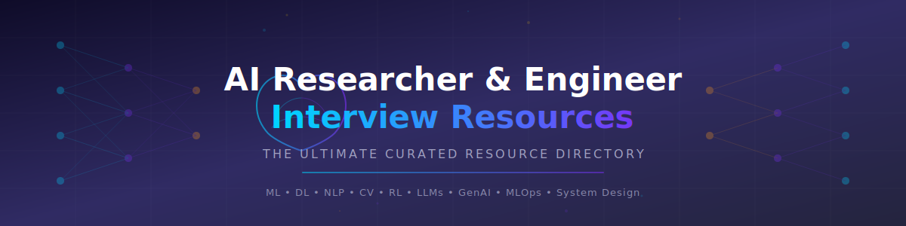

  

<h1 align="center">🧠 AI Researcher & Engineer Interview Resources</h1>

  <strong>The ultimate, community-driven resource directory for landing your dream AI/ML role.</strong> 
  <em>Curated resources for Machine Learning, Deep Learning, NLP, Computer Vision, Reinforcement Learning, LLMs, GenAI, MLOps, System Design & more.</em>

  
  
  
  
  
  
  
  
  

---

## 📖 How to Use This Repository

1. **Browse the Table of Contents** below to jump to your area of interest.
2. **Star ⭐ this repo** to bookmark it and help others discover it.
3. **Contribute** — found a great resource? Open a PR! See [CONTRIBUTING.md](CONTRIBUTING.md).
4. **Share** with fellow AI job seekers — knowledge grows when shared!

> 💡 **Tip:** Use `Ctrl+F` / `Cmd+F` to search for specific topics, tools, or company names.

---

## 📑 Table of Contents

- [📚 Foundational Knowledge](#-foundational-knowledge)
  - [🔢 Mathematics for AI](#-mathematics-for-ai)
  - [🤖 Machine Learning Fundamentals](#-machine-learning-fundamentals)
  - [🧬 Deep Learning](#-deep-learning)
- [🔬 Specialization Tracks](#-specialization-tracks)
  - [💬 Natural Language Processing (NLP)](#-natural-language-processing-nlp)
  - [👁️ Computer Vision (CV)](#-computer-vision-cv)
  - [🎮 Reinforcement Learning (RL)](#-reinforcement-learning-rl)
  - [✨ Generative AI & LLMs](#-generative-ai--llms)
  - [🖼️ Multimodal AI](#-multimodal-ai)
  - [🤖 Robotics & Embodied AI](#-robotics--embodied-ai)
  - [🛡️ AI Safety & Alignment](#-ai-safety--alignment)
- [💻 Coding & Programming](#-coding--programming)
  - [📐 Data Structures & Algorithms](#-data-structures--algorithms)
  - [🐍 Python for ML](#-python-for-ml)
  - [🧪 ML Coding Interviews](#-ml-coding-interviews)
- [🏗️ System Design for ML](#-system-design-for-ml)
- [🔧 MLOps & Production ML](#-mlops--production-ml)
- [📝 Research Skills](#-research-skills)
- [🎯 Interview Preparation](#-interview-preparation)
  - [📋 Types of AI Interviews](#-types-of-ai-interviews)
  - [🧠 ML Theory Questions](#-ml-theory-questions)
  - [🔬 Research Interview](#-research-interview)
  - [🗣️ Behavioral Interview](#-behavioral-interview)
  - [📦 Take-Home Assignments](#-take-home-assignments)
- [📄 Resume & Portfolio](#-resume--portfolio)
- [🏢 Job Search](#-job-search)
  - [📍 Job Boards](#-job-boards)
  - [🏛️ Top AI Labs & Companies](#-top-ai-labs--companies)
  - [🌐 Networking](#-networking)
- [💰 Salary & Negotiation](#-salary--negotiation)
- [📰 Staying Current](#-staying-current)
- [🏆 Competitions & Challenges](#-competitions--challenges)
- [🎓 Certifications](#-certifications)
- [🛠️ Tools & Frameworks](#-tools--frameworks)
- [📖 Must-Read Papers](#-must-read-papers)
- [🤝 Contributing](#-contributing)
- [📜 License](#-license)
- [⭐ Star History](#-star-history)

---

## 📚 Foundational Knowledge

### 🔢 Mathematics for AI

Strong mathematical foundations are non-negotiable for AI research and engineering roles.

#### Linear Algebra

| Resource | Type | Level | Free? |
|----------|------|-------|-------|
| [MIT 18.06 — Gilbert Strang](https://ocw.mit.edu/courses/18-06-linear-algebra-spring-2010/) | Course | Beginner–Intermediate | ✅ Free |
| [3Blue1Brown — Essence of Linear Algebra](https://www.youtube.com/playlist?list=PLZHQObOWTQDPD3MizzM2xVFitgF8hE_ab) | Video Series | Beginner | ✅ Free |
| [Linear Algebra Done Right — Sheldon Axler](https://linear.axler.net/) | Book | Intermediate | ✅ Free (online) |
| [Introduction to Linear Algebra — Gilbert Strang](https://math.mit.edu/~gs/linearalgebra/) | Book | Beginner | ❌ Paid |
| [Matrix Cookbook](https://www.math.uwaterloo.ca/~hwolkowi/matrixcookbook.pdf) | Cheat Sheet | Reference | ✅ Free |
| [Immersive Linear Algebra](http://immersivemath.com/ila/index.html) | Interactive Book | Beginner | ✅ Free |

#### Probability & Statistics

| Resource | Type | Level | Free? |
|----------|------|-------|-------|
| [MIT 6.041 — Probabilistic Systems Analysis](https://ocw.mit.edu/courses/6-041-probabilistic-systems-analysis-and-applied-probability-fall-2010/) | Course | Intermediate | ✅ Free |
| [Stat 110 — Harvard (Joe Blitzstein)](https://projects.iq.harvard.edu/stat110) | Course | Intermediate | ✅ Free |
| [Think Stats / Think Bayes — Allen Downey](https://greenteapress.com/wp/) | Books | Beginner | ✅ Free |
| [All of Statistics — Larry Wasserman](https://www.stat.cmu.edu/~larry/all-of-statistics/) | Book | Advanced | ❌ Paid |
| [Seeing Theory](https://seeing-theory.brown.edu/) | Interactive | Beginner | ✅ Free |
| [StatQuest (Josh Starmer)](https://www.youtube.com/@statquest) | YouTube | Beginner | ✅ Free |

#### Calculus & Optimization

| Resource | Type | Level | Free? |
|----------|------|-------|-------|
| [3Blue1Brown — Essence of Calculus](https://www.youtube.com/playlist?list=PLZHQObOWTQDMsr9K-rj53DwVRMYO3t5Yr) | Video Series | Beginner | ✅ Free |
| [MIT 18.01/18.02 — Single & Multivariable Calculus](https://ocw.mit.edu/courses/18-01-single-variable-calculus-fall-2006/) | Course | Beginner–Intermediate | ✅ Free |
| [Convex Optimization — Boyd & Vandenberghe](https://web.stanford.edu/~boyd/cvxbook/) | Book | Advanced | ✅ Free (online) |
| [Numerical Optimization — Nocedal & Wright](https://link.springer.com/book/10.1007/978-0-387-40065-5) | Book | Advanced | ❌ Paid |

#### Information Theory

| Resource | Type | Level | Free? |
|----------|------|-------|-------|
| [Information Theory, Inference and Learning Algorithms — David MacKay](https://www.inference.org.uk/itprnn/book.pdf) | Book | Intermediate | ✅ Free |
| [Elements of Information Theory — Cover & Thomas](https://onlinelibrary.wiley.com/doi/book/10.1002/047174882X) | Book | Advanced | ❌ Paid |
| [Visual Information Theory — Chris Olah](https://colah.github.io/posts/2015-09-Visual-Information/) | Blog Post | Beginner | ✅ Free |

---

### 🤖 Machine Learning Fundamentals

#### 📕 Top Books

| Book | Author(s) | Level | Free? |
|------|-----------|-------|-------|
| [An Introduction to Statistical Learning (ISLR)](https://www.statlearning.com/) | James, Witten, Hastie, Tibshirani | Beginner | ✅ Free (online) |
| [The Elements of Statistical Learning (ESL)](https://hastie.su.domains/ElemStatLearn/) | Hastie, Tibshirani, Friedman | Advanced | ✅ Free (online) |
| [Pattern Recognition and Machine Learning](https://www.microsoft.com/en-us/research/publication/pattern-recognition-machine-learning/) | Christopher Bishop | Intermediate | ✅ Free (PDF) |
| [Probabilistic Machine Learning (series)](https://probml.github.io/pml-book/) | Kevin Murphy | Intermediate–Advanced | ✅ Free (online) |
| [Machine Learning — A Probabilistic Perspective](https://probml.github.io/pml-book/book1.html) | Kevin Murphy | Advanced | ✅ Free (online) |
| [Hands-On Machine Learning](https://www.oreilly.com/library/view/hands-on-machine-learning/9781098125967/) | Aurélien Géron | Beginner–Intermediate | ❌ Paid |
| [Machine Learning Yearning](https://info.deeplearning.ai/machine-learning-yearning-book) | Andrew Ng | Beginner | ✅ Free |
| [Mathematics for Machine Learning](https://mml-book.github.io/) | Deisenroth, Faisal, Ong | Intermediate | ✅ Free (online) |

#### 🎓 Top Courses

| Course | Institution | Level | Free? |
|--------|-------------|-------|-------|
| [Machine Learning Specialization](https://www.coursera.org/specializations/machine-learning-introduction) | Stanford / DeepLearning.AI (Coursera) | Beginner | ✅ Free to audit |
| [CS229 — Machine Learning](https://cs229.stanford.edu/) | Stanford | Intermediate | ✅ Free (videos/notes) |
| [Learning from Data](https://home.work.caltech.edu/telecourse.html) | Caltech (Yaser Abu-Mostafa) | Intermediate | ✅ Free |
| [Machine Learning — MIT 6.036](https://openlearninglibrary.mit.edu/courses/course-v1:MITx+6.036+1T2019/about) | MIT | Intermediate | ✅ Free |
| [fast.ai — Practical ML](https://course.fast.ai/) | fast.ai | Beginner | ✅ Free |
| [Machine Learning with Python](https://www.edx.org/learn/machine-learning/massachusetts-institute-of-technology-machine-learning-with-python-from-linear-models-to-deep-learning) | MIT (edX) | Intermediate | ✅ Free to audit |

#### 🗝️ Key Concepts to Master

- Bias-Variance Tradeoff, Overfitting & Underfitting
- Regularization (L1/L2, Dropout, Early Stopping)
- Cross-Validation & Model Selection
- Linear & Logistic Regression
- Decision Trees, Random Forests, Gradient Boosting (XGBoost, LightGBM, CatBoost)
- Support Vector Machines (SVM)
- K-Nearest Neighbors, Naive Bayes
- Clustering (K-Means, DBSCAN, Hierarchical)
- Dimensionality Reduction (PCA, t-SNE, UMAP)
- Ensemble Methods (Bagging, Boosting, Stacking)
- Feature Engineering & Selection
- Evaluation Metrics (Precision, Recall, F1, AUC-ROC, MAE, RMSE)
- Bayesian Methods & Probabilistic Models

---

### 🧬 Deep Learning

#### 📕 Top Books

| Book | Author(s) | Level | Free? |
|------|-----------|-------|-------|
| [Deep Learning](https://www.deeplearningbook.org/) | Goodfellow, Bengio, Courville | Intermediate–Advanced | ✅ Free (online) |
| [Dive into Deep Learning](https://d2l.ai/) | Aston Zhang et al. | Intermediate | ✅ Free |
| [Neural Networks and Deep Learning](http://neuralnetworksanddeeplearning.com/) | Michael Nielsen | Beginner | ✅ Free |
| [Understanding Deep Learning](https://udlbook.github.io/udlbook/) | Simon Prince | Intermediate | ✅ Free (online) |
| [Deep Learning with Python](https://www.manning.com/books/deep-learning-with-python-second-edition) | François Chollet | Beginner–Intermediate | ❌ Paid |

#### 🎓 Top Courses

| Course | Institution | Level | Free? |
|--------|-------------|-------|-------|
| [CS231n — CNNs for Visual Recognition](http://cs231n.stanford.edu/) | Stanford | Intermediate | ✅ Free |
| [CS224n — NLP with Deep Learning](http://web.stanford.edu/class/cs224n/) | Stanford | Intermediate | ✅ Free |
| [Deep Learning Specialization](https://www.coursera.org/specializations/deep-learning) | DeepLearning.AI (Coursera) | Beginner–Intermediate | ✅ Free to audit |
| [fast.ai — Practical Deep Learning](https://course.fast.ai/) | fast.ai | Beginner | ✅ Free |
| [MIT 6.S191 — Intro to Deep Learning](http://introtodeeplearning.com/) | MIT | Beginner | ✅ Free |
| [Full Stack Deep Learning](https://fullstackdeeplearning.com/) | FSDL | Intermediate | ✅ Free |
| [NYU Deep Learning — Yann LeCun](https://atcold.github.io/NYU-DLSP21/) | NYU | Intermediate–Advanced | ✅ Free |

#### 🏛️ Architectures to Know

- **CNNs:** LeNet, AlexNet, VGG, GoogLeNet/Inception, ResNet, DenseNet, EfficientNet
- **RNNs:** Vanilla RNN, LSTM, GRU, Bidirectional RNNs
- **Transformers:** Attention Mechanism, Self-Attention, Multi-Head Attention, Positional Encoding
- **GANs:** Vanilla GAN, DCGAN, StyleGAN, CycleGAN, Pix2Pix
- **Autoencoders:** Vanilla AE, VAE, VQ-VAE, Denoising AE
- **Diffusion Models:** DDPM, Stable Diffusion, DALL-E
- **Graph Neural Networks:** GCN, GAT, GraphSAGE
- **State Space Models:** Mamba, S4, RWKV
- **Mixture of Experts (MoE):** Switch Transformer, GShard

---

## 🔬 Specialization Tracks

### 💬 Natural Language Processing (NLP)

#### Courses

| Course | Institution | Free? |
|--------|-------------|-------|
| [CS224n — NLP with Deep Learning](http://web.stanford.edu/class/cs224n/) | Stanford | ✅ Free |
| [NLP Specialization](https://www.coursera.org/specializations/natural-language-processing) | DeepLearning.AI | ✅ Audit free |
| [Hugging Face NLP Course](https://huggingface.co/learn/nlp-course) | Hugging Face | ✅ Free |
| [CMU CS 11-747 — Neural Nets for NLP](http://phontron.com/class/nn4nlp2024/) | CMU | ✅ Free |
| [Stanford CS 324 — Large Language Models](https://stanford-cs324.github.io/winter2022/) | Stanford | ✅ Free |

#### Books

| Book | Author(s) | Free? |
|------|-----------|-------|
| [Speech and Language Processing](https://web.stanford.edu/~jurafsky/slp3/) | Jurafsky & Martin | ✅ Free (draft) |
| [Natural Language Processing with Transformers](https://www.oreilly.com/library/view/natural-language-processing/9781098136789/) | Tunstall, von Werra, Wolf | ❌ Paid |
| [Foundations of Statistical NLP](https://nlp.stanford.edu/fsnlp/) | Manning & Schütze | ❌ Paid |

#### Key NLP Papers

- [Attention Is All You Need (2017)](https://arxiv.org/abs/1706.03762)
- [BERT: Pre-training of Deep Bidirectional Transformers (2018)](https://arxiv.org/abs/1810.04805)
- [GPT-2: Language Models are Unsupervised Multitask Learners (2019)](https://cdn.openai.com/better-language-models/language_models_are_unsupervised_multitask_learners.pdf)
- [T5: Exploring the Limits of Transfer Learning (2019)](https://arxiv.org/abs/1910.10683)
- [RoBERTa (2019)](https://arxiv.org/abs/1907.11692)
- [XLNet (2019)](https://arxiv.org/abs/1906.08237)

#### Frameworks & Libraries

- [Hugging Face Transformers](https://huggingface.co/docs/transformers/)
- [spaCy](https://spacy.io/)
- [NLTK](https://www.nltk.org/)
- [Stanza](https://stanfordnlp.github.io/stanza/)
- [Flair](https://github.com/flairNLP/flair)
- [SentenceTransformers](https://www.sbert.net/)

---

### 👁️ Computer Vision (CV)

#### Courses

| Course | Institution | Free? |
|--------|-------------|-------|
| [CS231n — CNNs for Visual Recognition](http://cs231n.stanford.edu/) | Stanford | ✅ Free |
| [CS280 — Computer Vision](https://cs280-berkeley.github.io/) | UC Berkeley | ✅ Free |
| [Deep Learning for Computer Vision](https://www.youtube.com/playlist?list=PL5-TkQAfAZFbzxjBHtzdVCWE0Zbhomg7r) | Michigan (Justin Johnson) | ✅ Free |
| [First Principles of Computer Vision](https://fpcv.cs.columbia.edu/) | Columbia | ✅ Free |

#### Key CV Papers

- [ImageNet Classification with Deep CNNs — AlexNet (2012)](https://papers.nips.cc/paper/2012/hash/c399862d3b9d6b76c8436e924a68c45b-Abstract.html)
- [Very Deep Convolutional Networks — VGG (2014)](https://arxiv.org/abs/1409.1556)
- [Deep Residual Learning — ResNet (2015)](https://arxiv.org/abs/1512.03385)
- [You Only Look Once — YOLO (2015)](https://arxiv.org/abs/1506.02640)
- [Feature Pyramid Networks (2017)](https://arxiv.org/abs/1612.03144)
- [An Image is Worth 16x16 Words — ViT (2020)](https://arxiv.org/abs/2010.11929)
- [Masked Autoencoders Are Scalable Vision Learners (2021)](https://arxiv.org/abs/2111.06377)
- [Segment Anything — SAM (2023)](https://arxiv.org/abs/2304.02643)

#### Frameworks

- [OpenCV](https://opencv.org/)
- [torchvision](https://pytorch.org/vision/)
- [Detectron2](https://github.com/facebookresearch/detectron2)
- [MMDetection](https://github.com/open-mmlab/mmdetection)
- [Ultralytics YOLO](https://github.com/ultralytics/ultralytics)
- [Albumentations](https://albumentations.ai/) (augmentations)

---

### 🎮 Reinforcement Learning (RL)

#### Courses

| Course | Institution | Free? |
|--------|-------------|-------|
| [Introduction to RL — David Silver](https://www.davidsilver.uk/teaching/) | UCL / DeepMind | ✅ Free |
| [CS285 — Deep Reinforcement Learning](http://rail.eecs.berkeley.edu/deeprlcourse/) | UC Berkeley | ✅ Free |
| [Spinning Up in Deep RL](https://spinningup.openai.com/) | OpenAI | ✅ Free |
| [RL Specialization](https://www.coursera.org/specializations/reinforcement-learning) | Alberta (Coursera) | ✅ Audit free |

#### Books

| Book | Author(s) | Free? |
|------|-----------|-------|
| [Reinforcement Learning: An Introduction](http://incompleteideas.net/book/the-book.html) | Sutton & Barto | ✅ Free (online) |
| [Algorithms for Decision Making](https://algorithmsbook.com/) | Kochenderfer et al. | ✅ Free (online) |

#### Frameworks

- [Gymnasium (OpenAI Gym)](https://gymnasium.farama.org/)
- [Stable-Baselines3](https://stable-baselines3.readthedocs.io/)
- [RLlib (Ray)](https://docs.ray.io/en/latest/rllib/)
- [CleanRL](https://github.com/vwxyzjn/cleanrl)
- [PettingZoo](https://pettingzoo.farama.org/) (multi-agent)

---

### ✨ Generative AI & LLMs

#### Key Papers

| Paper | Year | Notes |
|-------|------|-------|
| [Attention Is All You Need](https://arxiv.org/abs/1706.03762) | 2017 | Introduced the Transformer |
| [BERT](https://arxiv.org/abs/1810.04805) | 2018 | Bidirectional pre-training |
| [GPT-2](https://cdn.openai.com/better-language-models/language_models_are_unsupervised_multitask_learners.pdf) | 2019 | Unsupervised multitask learning |
| [GPT-3: Language Models are Few-Shot Learners](https://arxiv.org/abs/2005.14165) | 2020 | In-context learning |
| [DALL-E](https://arxiv.org/abs/2102.12092) | 2021 | Text-to-image generation |
| [InstructGPT / RLHF](https://arxiv.org/abs/2203.02155) | 2022 | Alignment via human feedback |
| [LLaMA](https://arxiv.org/abs/2302.13971) | 2023 | Open-source foundation models |
| [GPT-4 Technical Report](https://arxiv.org/abs/2303.08774) | 2023 | Multimodal capabilities |
| [Llama 2](https://arxiv.org/abs/2307.09288) | 2023 | Open & safe LLM |
| [Mixtral of Experts](https://arxiv.org/abs/2401.04088) | 2024 | Sparse MoE architecture |
| [Llama 3](https://arxiv.org/abs/2407.21783) | 2024 | Scaling open models |
| [DeepSeek-R1](https://arxiv.org/abs/2501.12948) | 2025 | Reasoning via RL |

#### Courses & Tutorials

| Course | Provider | Free? |
|--------|----------|-------|
| [Generative AI with LLMs](https://www.coursera.org/learn/generative-ai-with-llms) | DeepLearning.AI + AWS | ✅ Audit free |
| [LLM University](https://cohere.com/llmu) | Cohere | ✅ Free |
| [Prompt Engineering Guide](https://www.promptingguide.ai/) | DAIR.AI | ✅ Free |
| [LangChain Documentation & Tutorials](https://python.langchain.com/docs/tutorials/) | LangChain | ✅ Free |
| [Building RAG Agents with LLMs](https://learn.nvidia.com/courses/course-detail?course_id=course-v1:NVIDIA+S-FX-16+v1) | NVIDIA DLI | ✅ Free |
| [Hugging Face PEFT/LoRA](https://huggingface.co/docs/peft) | Hugging Face | ✅ Free |
| [State of GPT — Andrej Karpathy](https://www.youtube.com/watch?v=bZQun8Y4L2A) | Microsoft Build | ✅ Free |

#### Tools & Frameworks

| Tool | Purpose | Free Tier? |
|------|---------|------------|
| [LangChain](https://www.langchain.com/) | LLM application framework | ✅ Open source |
| [LlamaIndex](https://www.llamaindex.ai/) | Data framework for LLMs | ✅ Open source |
| [vLLM](https://github.com/vllm-project/vllm) | High-throughput LLM serving | ✅ Open source |
| [Ollama](https://ollama.com/) | Run LLMs locally | ✅ Free |
| [Hugging Face TGI](https://huggingface.co/docs/text-generation-inference) | Text generation inference | ✅ Open source |
| [OpenRouter](https://openrouter.ai/) | Unified LLM API | ✅ Free tier available |
| [Together AI](https://www.together.ai/) | LLM inference & fine-tuning | ✅ Free credits |
| [Groq](https://groq.com/) | Fast LLM inference | ✅ Free tier |
| [DSPy](https://github.com/stanfordnlp/dspy) | Programmatic LLM pipelines | ✅ Open source |
| [Guidance](https://github.com/guidance-ai/guidance) | Structured LLM outputs | ✅ Open source |

---

### 🖼️ Multimodal AI

#### Key Papers & Models

- [CLIP — Learning Transferable Visual Models (2021)](https://arxiv.org/abs/2103.00020)
- [DALL-E 2 — Hierarchical Text-Conditional Image Generation (2022)](https://arxiv.org/abs/2204.06125)
- [Flamingo — Visual Language Models (2022)](https://arxiv.org/abs/2204.14198)
- [LLaVA — Visual Instruction Tuning (2023)](https://arxiv.org/abs/2304.08485)
- [GPT-4V — Vision (2023)](https://arxiv.org/abs/2303.08774)
- [Gemini — A Family of Highly Capable Multimodal Models (2023)](https://arxiv.org/abs/2312.11805)

#### Frameworks

- [Hugging Face Transformers (multimodal pipelines)](https://huggingface.co/docs/transformers/main/en/tasks/image_text_to_text)
- [OpenCLIP](https://github.com/mlfoundations/open_clip)
- [LLaVA](https://github.com/haotian-liu/LLaVA)

---

### 🤖 Robotics & Embodied AI

#### Courses

| Course | Institution | Free? |
|--------|-------------|-------|
| [CS287 — Advanced Robotics](https://people.eecs.berkeley.edu/~pabbeel/cs287-fa19/) | UC Berkeley | ✅ Free |
| [Intro to Robotics — CS223A](https://cs.stanford.edu/groups/manips/teaching/cs223a/) | Stanford | ✅ Free |
| [Modern Robotics (Coursera)](https://www.coursera.org/specializations/modernrobotics) | Northwestern | ✅ Audit free |

#### Simulators & Tools

- [MuJoCo](https://mujoco.org/) — Physics simulator
- [Isaac Sim](https://developer.nvidia.com/isaac-sim) — NVIDIA robotics simulator
- [PyBullet](https://pybullet.org/) — Physics simulation
- [ROS 2](https://docs.ros.org/) — Robot Operating System
- [Habitat](https://aihabitat.org/) — Embodied AI simulator (Meta)

#### Key Papers

- [RT-2: Vision-Language-Action Models (2023)](https://arxiv.org/abs/2307.15818)
- [Learning Dexterous In-Hand Manipulation (2019)](https://arxiv.org/abs/1808.00177)
- [SayCan: Do As I Can (2022)](https://arxiv.org/abs/2204.01691)

---

### 🛡️ AI Safety & Alignment

#### Key Resources

| Resource | Type | Free? |
|----------|------|-------|
| [AI Safety Fundamentals](https://aisafetyfundamentals.com/) | Course | ✅ Free |
| [Intro to AI Safety — Robert Miles](https://www.youtube.com/@RobertMilesAI) | YouTube | ✅ Free |
| [Anthropic Research](https://www.anthropic.com/research) | Papers | ✅ Free |
| [Alignment Forum](https://www.alignmentforum.org/) | Community | ✅ Free |
| [ARC Evals](https://evals.alignment.org/) | Evaluations | ✅ Free |
| [MIRI Research](https://intelligence.org/research/) | Papers | ✅ Free |

#### Key Papers

- [Concrete Problems in AI Safety (2016)](https://arxiv.org/abs/1606.06565)
- [Constitutional AI (2022)](https://arxiv.org/abs/2212.08073)
- [Training Language Models to Follow Instructions with Human Feedback (2022)](https://arxiv.org/abs/2203.02155)
- [Scalable Oversight (2023)](https://arxiv.org/abs/2211.03540)

---

## 💻 Coding & Programming

### 📐 Data Structures & Algorithms

#### 📚 Books

| Book | Author(s) | Level |
|------|-----------|-------|
| [Introduction to Algorithms (CLRS)](https://mitpress.mit.edu/9780262046305/introduction-to-algorithms/) | Cormen et al. | Advanced |
| [The Algorithm Design Manual](https://www.algorist.com/) | Steven Skiena | Intermediate |
| [Cracking the Coding Interview](https://www.crackingthecodinginterview.com/) | Gayle McDowell | Interview-focused |
| [Elements of Programming Interviews in Python](https://elementsofprogramminginterviews.com/) | Aziz, Lee, Prakash | Interview-focused |
| [Grokking Algorithms](https://www.manning.com/books/grokking-algorithms) | Aditya Bhargava | Beginner |

#### 🔗 Platforms

| Platform | Free Tier | Paid Plans | Best For |
|----------|-----------|------------|----------|
| [LeetCode](https://leetcode.com/) | ✅ 2000+ free problems | Premium: $35/mo or $159/yr | Interview prep, patterns |
| [HackerRank](https://www.hackerrank.com/) | ✅ Full problem set free | Pro: Custom pricing (enterprise) | Skill certification |
| [CodeSignal](https://codesignal.com/) | ✅ Practice free | Enterprise: Custom pricing | Company assessments |
| [NeetCode](https://neetcode.io/) | ✅ 150 free problems + videos | Pro: $99/yr | Curated patterns |
| [AlgoExpert](https://www.algoexpert.io/) | ❌ No free tier | $99/yr (one product), $149/yr (bundle) | Video explanations |
| [Codeforces](https://codeforces.com/) | ✅ Fully free | N/A | Competitive programming |
| [Project Euler](https://projecteuler.net/) | ✅ Fully free | N/A | Mathematical problems |

#### 🗂️ Study Plans & Patterns

- [Blind 75](https://leetcode.com/discuss/general-discussion/460599/blind-75-leetcode-questions) — The classic curated list
- [NeetCode 150](https://neetcode.io/practice) — Extended & organized by topic
- [Grind 75](https://www.techinterviewhandbook.org/grind75) — Customizable study plan
- [14 Patterns to Ace Coding Interviews](https://hackernoon.com/14-patterns-to-ace-any-coding-interview-question-c5bb3357f6ed)
- [LeetCode Patterns](https://seanprashad.com/leetcode-patterns/) — Problems grouped by pattern

---

### 🐍 Python for ML

| Resource | Type | Free? |
|----------|------|-------|
| [Python Data Science Handbook](https://jakevdp.github.io/PythonDataScienceHandbook/) | Book (online) | ✅ Free |
| [NumPy User Guide](https://numpy.org/doc/stable/user/index.html) | Documentation | ✅ Free |
| [Pandas Documentation](https://pandas.pydata.org/docs/) | Documentation | ✅ Free |
| [Scikit-learn Tutorials](https://scikit-learn.org/stable/tutorial/) | Documentation | ✅ Free |
| [Real Python — ML Tutorials](https://realpython.com/tutorials/machine-learning/) | Tutorials | ✅ Some free |
| [Python for Data Analysis — Wes McKinney](https://wesmckinney.com/book/) | Book | ✅ Free (online) |

---

### 🧪 ML Coding Interviews

#### Implement from Scratch

- [ML from Scratch](https://github.com/eriklindernoren/ML-From-Scratch) — Python implementations of ML algorithms
- [Implementing ML algorithms from scratch (blog)](https://github.com/rushter/MLAlgorithms) — Clean implementations
- [Deep Learning from Scratch (NumPy only)](https://github.com/SethHWeidman/DLFS_code) — Build neural nets with NumPy

#### Common ML Coding Questions

- Implement linear regression / logistic regression from scratch
- Implement gradient descent (batch, stochastic, mini-batch)
- Build a decision tree from scratch
- Implement K-Means clustering
- Write a simple neural network (forward/backward pass)
- Implement attention mechanism
- Build a tokenizer (BPE)
- Write evaluation metrics (precision, recall, AUC)
- Implement batch normalization / layer normalization
- Build a simple autograd engine (like micrograd)

---

## 🏗️ System Design for ML

### 📚 Resources

| Resource | Type | Free? |
|----------|------|-------|
| [Designing Machine Learning Systems — Chip Huyen](https://www.oreilly.com/library/view/designing-machine-learning/9781098107956/) | Book | ❌ Paid |
| [Machine Learning System Design Interview — Ali Aminian & Alex Xu](https://www.amazon.com/Machine-Learning-System-Design-Interview/dp/1736049127) | Book | ❌ Paid |
| [Made With ML](https://madewithml.com/) | Course | ✅ Free |
| [ML System Design (GitHub)](https://github.com/chiphuyen/machine-learning-systems-design) | Guide | ✅ Free |
| [Stanford CS 329S — ML Systems Design](https://stanford-cs329s.github.io/) | Course | ✅ Free |
| [The ML Engineer Handbook](https://www.educative.io/courses/machine-learning-system-design) | Course | ❌ Paid |

### 🏛️ Key Patterns & Components

- **Feature Stores:** Feast, Tecton, Hopsworks
- **Model Serving:** TensorFlow Serving, TorchServe, Triton Inference Server, BentoML
- **Data Pipelines:** Apache Beam, Airflow, Prefect, Dagster
- **A/B Testing & Experimentation:** Statistical significance, multi-armed bandits
- **Model Monitoring:** Data drift, concept drift, performance degradation

### 🏷️ Case Studies to Practice

| System | Key Challenges |
|--------|---------------|
| 🎬 Recommendation System (Netflix/YouTube) | Collaborative filtering, content-based, hybrid, cold start |
| 🔍 Search Ranking (Google) | Learning to rank, query understanding, relevance |
| 📢 Ad Click Prediction (Meta/Google) | CTR prediction, real-time serving, feature engineering |
| 🗞️ News Feed Ranking (Facebook/Twitter) | Engagement prediction, diversity, freshness |
| 🛡️ Fraud Detection | Imbalanced data, real-time, graph features |
| 💬 Chatbot / Conversational AI | Intent classification, entity extraction, dialog management |
| 🚗 Self-Driving Car Perception | Object detection, sensor fusion, real-time constraints |
| 🔤 Machine Translation | Seq2seq, attention, BPE tokenization |
| 🖼️ Image Generation | Diffusion models, GANs, quality metrics |
| 📧 Spam Detection | Text classification, adversarial robustness |

---

## 🔧 MLOps & Production ML

### 🛠️ Frameworks & Tools

| Tool | Purpose | Free Tier | Paid Plans |
|------|---------|-----------|------------|
| [MLflow](https://mlflow.org/) | Experiment tracking, model registry | ✅ Open source | Managed: Databricks pricing |
| [Weights & Biases (W&B)](https://wandb.ai/) | Experiment tracking, visualization | ✅ Free for individuals | Teams: $50/user/mo |
| [Neptune.ai](https://neptune.ai/) | Experiment tracking | ✅ Free (individual, 1 user) | Team: from $49/mo |
| [DVC](https://dvc.org/) | Data & model versioning | ✅ Open source | Studio: from $75/mo |
| [Kubeflow](https://www.kubeflow.org/) | ML pipelines on Kubernetes | ✅ Open source | Self-hosted |
| [Metaflow](https://metaflow.org/) | ML pipelines | ✅ Open source | Netflix infrastructure |
| [ZenML](https://zenml.io/) | MLOps framework | ✅ Free (community) | Pro: from $49/mo |
| [BentoML](https://www.bentoml.com/) | Model serving & deployment | ✅ Open source | Cloud: usage-based |
| [Seldon Core](https://www.seldon.io/) | Model deployment on K8s | ✅ Open source | Enterprise: custom |
| [Great Expectations](https://greatexpectations.io/) | Data quality & validation | ✅ Open source | Cloud: from $100/mo |
| [Evidently AI](https://www.evidentlyai.com/) | ML monitoring & observability | ✅ Open source | Cloud: from $500/mo |
| [Feast](https://feast.dev/) | Feature store | ✅ Open source | Self-hosted |
| [Tecton](https://www.tecton.ai/) | Feature store (managed) | ❌ No free tier | Enterprise: custom pricing |
| [Label Studio](https://labelstud.io/) | Data labeling | ✅ Open source | Enterprise: custom |

### 📋 Key Topics

- **CI/CD for ML:** Testing models, data validation, automated retraining
- **Model Monitoring:** Data drift, concept drift, performance degradation, alerting
- **Feature Stores:** Online vs. offline features, point-in-time correctness
- **Model Registries:** Versioning, staging, production promotion
- **Infrastructure as Code:** Terraform, Pulumi for ML infrastructure
- **Containerization:** Docker, Kubernetes for ML workloads

---

## 📝 Research Skills

### 📖 Reading Papers

| Resource | Type | Free? |
|----------|------|-------|
| [How to Read a Paper — S. Keshav](http://ccr.sigcomm.org/online/files/p83-keshavA.pdf) | Guide | ✅ Free |
| [Semantic Scholar](https://www.semanticscholar.org/) | Search Engine | ✅ Free |
| [Connected Papers](https://www.connectedpapers.com/) | Visualization | ✅ Free (5 graphs/mo), Pro: $3/mo |
| [Papers With Code](https://paperswithcode.com/) | Papers + Benchmarks | ✅ Free |
| [arXiv](https://arxiv.org/) | Preprint Server | ✅ Free |
| [Google Scholar](https://scholar.google.com/) | Search Engine | ✅ Free |
| [Arxiv Sanity](https://arxiv-sanity-lite.com/) | Paper Discovery | ✅ Free |
| [Elicit](https://elicit.com/) | AI Research Assistant | ✅ Free tier (10 papers/mo), Plus: $10/mo |
| [Consensus](https://consensus.app/) | AI Search for Research | ✅ Free tier, Premium: $8.99/mo |

### ✍️ Writing Papers

- [Overleaf](https://www.overleaf.com/) — Online LaTeX editor (Free tier: 1 collaborator; Premium: $15/mo)
- [LaTeX for Beginners](https://www.overleaf.com/learn/latex/Learn_LaTeX_in_30_minutes)
- [How to Write a Great Research Paper — Simon Peyton Jones (video)](https://www.youtube.com/watch?v=VK51E3gHENc)
- [Tips for Writing NLP Papers — ACL](https://acl-org.github.io/policies/paper-formatting-guidelines/)
- [ML Writing Advice — Devi Parikh](https://deviparikh.medium.com/)

### 🔁 Reproducing Papers

- [Papers With Code](https://paperswithcode.com/) — Find code implementations
- [Reproducibility Checklist — NeurIPS](https://www.cs.mcgill.ca/~jpineau/ReproducibilityChecklist.pdf)
- [ML Reproducibility Challenge](https://reproml.org/)
- Tips: Start with official repos, use Docker, verify on small datasets first

---

## 🎯 Interview Preparation

### 📋 Types of AI Interviews

| Stage | What to Expect | Duration |
|-------|---------------|----------|
| 📞 **Phone Screen** | Resume discussion, basic ML concepts, motivation | 30–45 min |
| 💻 **Coding Interview** | DSA problems, sometimes ML-specific coding | 45–60 min |
| 🧠 **ML Theory / Deep Dive** | In-depth ML concepts, architecture choices, tradeoffs | 45–60 min |
| 🏗️ **System Design** | Design an ML system end-to-end | 45–60 min |
| 🔬 **Research Presentation** | Present your past research, Q&A | 45–60 min |
| 🗣️ **Behavioral** | Teamwork, conflict resolution, leadership | 30–45 min |
| 📦 **Take-Home Assignment** | Implement a model, analyze data, write a report | 3–7 days |

---

### 🧠 ML Theory Questions

#### Question Banks & Guides

| Resource | Free? |
|----------|-------|
| [Machine Learning Interview Questions — Chip Huyen](https://huyenchip.com/ml-interviews-book/) | ✅ Free (online) |
| [Deep Learning Interviews — Shlomo Kashani](https://arxiv.org/abs/2201.00650) | ✅ Free |
| [ML Interview Prep — Khang Pham](https://github.com/khangich/machine-learning-interview) | ✅ Free |
| [Stanford CS229 Cheatsheets](https://stanford.edu/~shervine/teaching/cs-229/) | ✅ Free |
| [InterviewBit ML Questions](https://www.interviewbit.com/machine-learning-interview-questions/) | ✅ Free |

#### 🔑 Top Topics & Sample Questions

<strong>Bias-Variance Tradeoff</strong>

- What is the bias-variance tradeoff? How does it affect model performance?
- How do you detect high bias vs. high variance?
- What techniques reduce bias? What techniques reduce variance?

<strong>Regularization</strong>

- Explain L1 vs L2 regularization. When would you use each?
- How does dropout work? Why is it effective?
- What is early stopping and how does it regularize?

<strong>Gradient Descent & Optimization</strong>

- Compare SGD, Adam, AdaGrad, and RMSProp.
- What is the vanishing/exploding gradient problem? How do you solve it?
- Explain learning rate scheduling strategies.

<strong>Transformers & Attention</strong>

- Explain the self-attention mechanism in detail.
- What is multi-head attention and why is it useful?
- How does positional encoding work?
- Compare encoder-only, decoder-only, and encoder-decoder architectures.

<strong>Evaluation Metrics</strong>

- When would you use precision vs. recall vs. F1?
- Explain AUC-ROC and AUC-PR. When is each appropriate?
- How do you evaluate generative models (BLEU, ROUGE, perplexity, FID)?

<strong>Large Language Models</strong>

- Explain the training process for modern LLMs (pre-training → SFT → RLHF/DPO).
- What is in-context learning? How does it differ from fine-tuning?
- Explain LoRA and QLoRA. Why are they useful?
- What is RAG? When would you use it vs. fine-tuning?

---

### 🔬 Research Interview

#### How to Present Your Research

- **Structure:** Problem → Motivation → Approach → Results → Impact → Future Work
- **Know your paper inside out:** every equation, every design choice, every baseline
- **Prepare for "why" questions:** Why this architecture? Why this loss function? Why this dataset?
- **Anticipate weaknesses:** Be honest about limitations and how you'd address them

#### Common Research Interview Questions

- What is your most impactful research contribution?
- Walk me through your paper [X] — what would you do differently now?
- How do you choose research problems?
- How do you stay current with the latest research?
- Describe a time when your initial hypothesis was wrong. What did you do?

---

### 🗣️ Behavioral Interview

#### The STAR Method

- **S**ituation — Set the context
- **T**ask — Describe your responsibility
- **A**ction — Explain what you did
- **R**esult — Share the outcome (quantify if possible)

#### Common Behavioral Questions for AI Roles

- Tell me about a challenging ML project. What went wrong and how did you fix it?
- Describe a time you had to explain a complex technical concept to a non-technical audience.
- How do you prioritize when you have multiple experiments to run?
- Tell me about a time you disagreed with a team member on an approach.
- How do you handle ambiguity in research/project requirements?
- Describe a time you had to make a tradeoff between model performance and latency.

---

### 📦 Take-Home Assignments

#### Tips

- **Read the prompt carefully** — understand evaluation criteria
- **Start with EDA** — show you understand the data
- **Establish a baseline first** — don't jump to complex models
- **Document your thought process** — notebooks with clear explanations win
- **Code quality matters** — clean code, proper functions, docstrings
- **Include error analysis** — show you understand model failures
- **Time management** — don't over-engineer; finish a complete pipeline

---

## 📄 Resume & Portfolio

### 📝 Resume Tips for AI Roles

| Resource | Type | Free? |
|----------|------|-------|
| [Overleaf Resume Templates](https://www.overleaf.com/latex/templates/tagged/cv) | Templates | ✅ Free |
| [Jake's Resume (LaTeX)](https://github.com/jakegut/resume) | Template | ✅ Free |
| [Awesome CV (LaTeX)](https://github.com/posquit0/Awesome-CV) | Template | ✅ Free |
| [FlowCV](https://flowcv.io/) | Resume Builder | ✅ Free tier |
| [Tech Interview Handbook — Resume Guide](https://www.techinterviewhandbook.org/resume/) | Guide | ✅ Free |

#### Key Resume Tips

- **Quantify impact:** "Improved model accuracy from 85% → 93%" not "improved model accuracy"
- **Highlight publications:** List conference papers prominently
- **Include relevant projects:** GitHub repos, Kaggle competitions, personal projects
- **Tailor to the role:** Emphasize research for research roles, production for engineering roles
- **Keep it to 1–2 pages** — prioritize relevance

### 🌐 Portfolio Building

- **GitHub:** Maintain clean, well-documented repos with READMEs
- **Blog:** Write about your projects (Medium, Substack, personal site)
- **Kaggle:** Participate in competitions, earn medals
- **Papers:** Preprints on arXiv count
- **Talks:** Conference presentations, meetup talks, YouTube videos

### 🔨 Website Builders

| Platform | Free Tier | Paid Plans |
|----------|-----------|------------|
| [GitHub Pages](https://pages.github.com/) | ✅ Free | N/A |
| [Hugo + Academic Theme](https://github.com/HugoBlox/hugo-blox-builder) | ✅ Free | N/A |
| [Jekyll](https://jekyllrb.com/) | ✅ Free (with GH Pages) | N/A |
| [Vercel](https://vercel.com/) | ✅ Free (hobby) | Pro: $20/mo |
| [Notion + Super.so](https://super.so/) | ✅ Limited free | Pro: $16/mo |

---

## 🏢 Job Search

### 📍 Job Boards

| Platform | Focus | Free Tier | Paid Plans |
|----------|-------|-----------|------------|
| [LinkedIn Jobs](https://www.linkedin.com/jobs/) | General | ✅ Free to apply | Premium: from $29.99/mo |
| [Indeed](https://www.indeed.com/) | General | ✅ Free | N/A (for seekers) |
| [Glassdoor](https://www.glassdoor.com/) | General + Reviews | ✅ Free | N/A (for seekers) |
| [ai-jobs.net](https://ai-jobs.net/) | AI/ML specific | ✅ Free | N/A |
| [MLJobs.ai](https://mljobs.ai/) | ML specific | ✅ Free | N/A |
| [DeepLearning.AI Job Board](https://jobs.deeplearning.ai/) | DL/AI specific | ✅ Free | N/A |
| [Hugging Face Jobs](https://apply.workable.com/huggingface/) | AI/NLP | ✅ Free | N/A |
| [AI/ML Jobs (levels.fyi)](https://www.levels.fyi/t/ai-ml-engineer) | AI/ML + comp data | ✅ Free | N/A |
| [Y Combinator — Work at a Startup](https://www.workatastartup.com/) | Startups | ✅ Free | N/A |
| [Wellfound (AngelList)](https://wellfound.com/) | Startups | ✅ Free | N/A |
| [RemoteML](https://remoteml.com/) | Remote ML jobs | ✅ Free | N/A |
| [Turing](https://www.turing.com/) | Remote AI/ML | ✅ Free | N/A |

---

### 🏛️ Top AI Labs & Companies

#### 🔬 Leading AI Research Labs

| Lab | Parent Company | Focus Areas |
|-----|---------------|-------------|
| [Google DeepMind](https://deepmind.google/) | Alphabet/Google | AGI, science, foundational models |
| [OpenAI](https://openai.com/) | Independent | LLMs, AGI, safety |
| [Anthropic](https://www.anthropic.com/) | Independent | AI safety, Constitutional AI |
| [Meta FAIR](https://ai.meta.com/research/) | Meta | Open research, LLaMA, CV |
| [Microsoft Research](https://www.microsoft.com/en-us/research/) | Microsoft | Broad AI, Azure AI |
| [Google Research](https://research.google/) | Google | Broad AI, Gemini |
| [NVIDIA Research](https://www.nvidia.com/en-us/research/) | NVIDIA | GPU computing, robotics, GenAI |
| [Apple ML Research](https://machinelearning.apple.com/) | Apple | On-device ML, privacy |
| [Amazon Science](https://www.amazon.science/) | Amazon | NLP, Alexa, robotics |
| [xAI](https://x.ai/) | xAI | Grok, understanding the universe |
| [Mistral AI](https://mistral.ai/) | Independent | Open-weight LLMs |
| [Cohere](https://cohere.com/) | Independent | Enterprise NLP/LLMs |
| [AI2 (Allen Institute)](https://allenai.org/) | Non-profit | Open research, OLMo |
| [Stability AI](https://stability.ai/) | Independent | Open generative models |
| [EleutherAI](https://www.eleuther.ai/) | Non-profit | Open-source LLMs |
| [Hugging Face](https://huggingface.co/) | Independent | Open-source ML ecosystem |

#### 🏢 Big Tech AI Teams

- **Google:** Google AI, Google Cloud AI, Waymo, Google Health AI
- **Meta:** FAIR, GenAI team, Reality Labs, Instagram ML
- **Apple:** Core ML, Siri, Apple Vision Pro ML
- **Amazon:** Alexa AI, AWS AI/ML, Amazon Robotics, Amazon Science
- **Microsoft:** Azure AI, Copilot, Bing AI, GitHub Copilot
- **Netflix:** Recommendations, Content Understanding, Personalization
- **Uber:** Maps, Marketplace, Self-Driving (Aurora)
- **Spotify:** Recommendations, NLP, Audio ML
- **Tesla:** Autopilot, Tesla Bot (Optimus)
- **ByteDance:** TikTok Recommendation, AI Lab

---

### 🌐 Networking

#### 🎓 Top AI Conferences

| Conference | Focus | Typical Deadline | Venue |
|-----------|-------|-----------------|-------|
| [NeurIPS](https://neurips.cc/) | General ML/AI | May | December |
| [ICML](https://icml.cc/) | General ML | January | July |
| [ICLR](https://iclr.cc/) | Representation Learning | September | May |
| [CVPR](https://cvpr.thecvf.com/) | Computer Vision | November | June |
| [ICCV](https://iccv2025.thecvf.com/) | Computer Vision | March | October (odd years) |
| [ECCV](https://eccv.ecva.net/) | Computer Vision | March | October (even years) |
| [ACL](https://www.aclweb.org/portal/) | NLP | January | July |
| [EMNLP](https://2024.emnlp.org/) | NLP | June | December |
| [NAACL](https://naacl.org/) | NLP (Americas) | December | June |
| [AAAI](https://aaai.org/) | General AI | August | February |
| [IJCAI](https://www.ijcai.org/) | General AI | January | August |
| [KDD](https://kdd.org/) | Data Mining | February | August |
| [SIGIR](https://sigir.org/) | Information Retrieval | January | July |

#### 💬 Communities

- [r/MachineLearning](https://www.reddit.com/r/MachineLearning/) — Reddit
- [r/learnmachinelearning](https://www.reddit.com/r/learnmachinelearning/) — Reddit
- [Hugging Face Discord](https://huggingface.co/join/discord)
- [MLOps Community](https://mlops.community/)
- [Papers We Love](https://paperswelove.org/)
- [AI/ML Twitter/X](https://twitter.com/) — Follow researchers and practitioners
- [Kaggle Community](https://www.kaggle.com/discussions)

---

## 💰 Salary & Negotiation

### 📊 Salary Data Sources

| Platform | Free? | Notes |
|----------|-------|-------|
| [Levels.fyi](https://www.levels.fyi/) | ✅ Free | Best for tech compensation data |
| [Glassdoor](https://www.glassdoor.com/Salaries/) | ✅ Free | Requires account |
| [Blind](https://www.teamblind.com/) | ✅ Free | Anonymous tech community |
| [Comprehensive.io](https://www.comprehensive.io/) | ✅ Free | Startup equity calculator |
| [H1B Salary Database](https://h1bdata.info/) | ✅ Free | Visa salary data |

### 💡 Negotiation Resources

- [Ten Rules for Negotiating a Job Offer — Haseeb Qureshi](https://haseebq.com/my-ten-rules-for-negotiating-a-job-offer/)
- [Salary Negotiation Guide — levels.fyi](https://www.levels.fyi/blog/salary-negotiation-guide.html)
- [Never Split the Difference — Chris Voss](https://www.amazon.com/Never-Split-Difference-Negotiating-Depended/dp/0062407805) (Book)
- [Candor Salary Negotiation](https://candor.co/guides/salary-negotiation)

### 📈 Typical AI/ML Compensation (US, 2025)

| Level | Base Salary | Total Compensation (incl. equity) |
|-------|------------|----------------------------------|
| Junior MLE (0–2 yrs) | $120K–$170K | $150K–$250K |
| Mid MLE (2–5 yrs) | $160K–$220K | $250K–$400K |
| Senior MLE (5–8 yrs) | $200K–$300K | $350K–$600K |
| Staff MLE (8+ yrs) | $250K–$400K | $500K–$900K |
| Research Scientist | $150K–$250K | $200K–$500K |
| Senior Research Scientist | $220K–$350K | $400K–$800K |

> ⚠️ Compensation varies significantly by company, location, and specialization. FAANG/top-tier companies tend to be at the higher end.

---

## 📰 Staying Current

### 📧 Newsletters

| Newsletter | Author/Org | Frequency | Free? |
|-----------|-----------|-----------|-------|
| [The Batch](https://www.deeplearning.ai/the-batch/) | DeepLearning.AI | Weekly | ✅ Free |
| [Import AI](https://importai.substack.com/) | Jack Clark | Weekly | ✅ Free |
| [The AI Index](https://aiindex.stanford.edu/) | Stanford HAI | Annual Report | ✅ Free |
| [TLDR AI](https://tldr.tech/ai) | TLDR | Daily | ✅ Free |
| [Davis Summarizes Papers](https://dblalock.substack.com/) | Davis Blalock | Weekly | ✅ Free |
| [Ahead of AI](https://magazine.sebastianraschka.com/) | Sebastian Raschka | Bi-weekly | ✅ Free |
| [The Gradient](https://thegradient.pub/) | Community | Weekly | ✅ Free |
| [AI Weekly](https://aiweekly.co/) | AI Weekly | Weekly | ✅ Free |

### ✍️ Blogs

| Blog | Author | Focus |
|------|--------|-------|
| [Distill.pub](https://distill.pub/) | Various | Clear ML explanations (archived but valuable) |
| [Lil'Log](https://lilianweng.github.io/) | Lilian Weng (OpenAI) | Deep dives into ML topics |
| [Jay Alammar](https://jalammar.github.io/) | Jay Alammar | Visual ML explanations |
| [Andrej Karpathy's blog](https://karpathy.github.io/) | Andrej Karpathy | Deep learning insights |
| [Chris Olah's blog](https://colah.github.io/) | Chris Olah | Neural net visualizations |
| [Sebastian Ruder's blog](https://www.ruder.io/) | Sebastian Ruder | NLP research |
| [The AI Summer](https://theaisummer.com/) | Various | Deep learning tutorials |
| [Eugene Yan](https://eugeneyan.com/) | Eugene Yan | ML in production, RecSys |
| [Chip Huyen](https://huyenchip.com/blog/) | Chip Huyen | ML systems, career advice |
| [Google AI Blog](https://blog.research.google/) | Google | Research updates |
| [Meta AI Blog](https://ai.meta.com/blog/) | Meta | Research & releases |

### 🎥 YouTube Channels

| Channel | Focus | Best For |
|---------|-------|----------|
| [3Blue1Brown](https://www.youtube.com/@3blue1brown) | Math visualizations | Building intuition |
| [Yannic Kilcher](https://www.youtube.com/@YannicKilcher) | Paper reviews | Staying current with research |
| [Two Minute Papers](https://www.youtube.com/@TwoMinutePapers) | Research highlights | Quick paper summaries |
| [Andrej Karpathy](https://www.youtube.com/@AndrejKarpathy) | Deep learning | Build from scratch |
| [StatQuest](https://www.youtube.com/@statquest) | Statistics & ML | Fundamentals |
| [Arxiv Insights](https://www.youtube.com/@ArxivInsights) | Paper deep dives | Understanding papers |
| [Mu Li (d2l)](https://www.youtube.com/@mu_li) | DL theory + practice | Comprehensive learning |
| [Machine Learning Street Talk](https://www.youtube.com/@MachineLearningStreetTalk) | Interviews & discussion | Expert perspectives |
| [Lex Fridman](https://www.youtube.com/@lexfridman) | AI interviews | Big-picture thinking |
| [sentdex](https://www.youtube.com/@sentdex) | Python ML tutorials | Hands-on coding |
| [DeepLearning.AI](https://www.youtube.com/@Deeplearningai) | Courses & events | Structured learning |
| [AI Explained](https://www.youtube.com/@aiexplained-official) | AI news & analysis | Staying current |

### 🎙️ Podcasts

| Podcast | Host(s) | Focus |
|---------|---------|-------|
| [Lex Fridman Podcast](https://lexfridman.com/podcast/) | Lex Fridman | Long-form AI interviews |
| [Machine Learning Street Talk](https://www.youtube.com/@MachineLearningStreetTalk) | Tim Scarfe et al. | Research deep dives |
| [Gradient Dissent](https://wandb.ai/fully-connected/gradient-dissent) | W&B | Practitioner interviews |
| [TWIML (This Week in ML)](https://twimlai.com/) | Sam Charrington | Industry & research |
| [Practical AI](https://changelog.com/practicalai) | Changelog | Applied AI |
| [The Robot Brains](https://www.therobotbrains.ai/) | Pieter Abbeel | Robotics & AI |
| [Latent Space](https://www.latent.space/) | swyx & Alessio | AI engineering |
| [Eye on AI](https://www.eye-on.ai/) | Craig Smith | AI industry trends |

### 🐦 Twitter/X Accounts to Follow

- [@ylecun](https://twitter.com/ylecun) — Yann LeCun (Meta Chief AI Scientist)
- [@kaboré](https://twitter.com/kaboremm) — Research community
- [@AndrewYNg](https://twitter.com/AndrewYNg) — Andrew Ng
- [@kaboremm](https://twitter.com/kaboremm) — Research threads
- [@_jasonwei](https://twitter.com/_jasonwei) — Jason Wei (Google)
- [@chipro](https://twitter.com/chipro) — Chip Huyen
- [@iaboreal](https://twitter.com/iaboreal) — AI research threads
- [@EMostaque](https://twitter.com/EMostaque) — Emad Mostaque
- [@DrJimFan](https://twitter.com/DrJimFan) — Jim Fan (NVIDIA)
- [@swaboreal](https://twitter.com/swaboreal) — swyx
- [@kaboremm](https://twitter.com/karpathy) — Andrej Karpathy
- [@sama](https://twitter.com/sama) — Sam Altman

---

## 🏆 Competitions & Challenges

| Platform | Focus | Free Tier | Paid Plans |
|----------|-------|-----------|------------|
| [Kaggle](https://www.kaggle.com/) | Data science & ML | ✅ Free (+ free GPUs) | N/A |
| [DrivenData](https://www.drivendata.org/) | Social impact ML | ✅ Free | N/A |
| [AIcrowd](https://www.aicrowd.com/) | Research challenges | ✅ Free | N/A |
| [Zindi](https://zindi.africa/) | Africa-focused ML | ✅ Free | N/A |
| [CodaLab](https://codalab.lisn.upsaclay.fr/) | Research benchmarks | ✅ Free | N/A |
| [Eval AI](https://eval.ai/) | AI challenges | ✅ Free | N/A |
| [ML Contests](https://mlcontests.com/) | Aggregator | ✅ Free | N/A |

### 💡 How Competitions Help Your Job Search

- 🥇 **Medals & rankings** are credible signals to recruiters
- 📊 **Kaggle Notebooks** showcase your analytical thinking
- 🤝 **Team competitions** demonstrate collaboration skills
- 📝 **Write-ups** of your approach make great portfolio pieces

---

## 🎓 Certifications

| Certification | Provider | Cost | Duration | Notes |
|--------------|----------|------|----------|-------|
| [TensorFlow Developer Certificate](https://www.tensorflow.org/certificate) | Google | $100 | Self-paced | Hands-on TF skills |
| [AWS Machine Learning Specialty](https://aws.amazon.com/certification/certified-machine-learning-specialty/) | AWS | $300 | Self-paced | AWS ML services |
| [Google Professional ML Engineer](https://cloud.google.com/learn/certification/machine-learning-engineer) | Google Cloud | $200 | Self-paced | GCP ML focus |
| [Azure AI Engineer Associate](https://learn.microsoft.com/en-us/credentials/certifications/azure-ai-engineer/) | Microsoft | $165 | Self-paced | Azure AI services |
| [Deep Learning Specialization](https://www.coursera.org/specializations/deep-learning) | DeepLearning.AI | ✅ Free to audit, $49/mo for cert | ~5 months | Foundational DL |
| [Machine Learning Specialization](https://www.coursera.org/specializations/machine-learning-introduction) | Stanford/DL.AI | ✅ Free to audit, $49/mo for cert | ~3 months | Foundational ML |
| [MLOps Specialization](https://www.coursera.org/specializations/machine-learning-engineering-for-production-mlops) | DeepLearning.AI | ✅ Free to audit, $49/mo for cert | ~4 months | Production ML |
| [Hugging Face Certification](https://huggingface.co/learn) | Hugging Face | ✅ Free | Self-paced | NLP & Transformers |
| [NVIDIA Deep Learning Institute](https://www.nvidia.com/en-us/training/) | NVIDIA | Varies ($30–$90/course) | Self-paced | GPU computing, DL |

> 💡 **Note:** Certifications are supplementary — they don't replace projects, publications, or hands-on experience. Most hiring managers value demonstrated skills over certificates.

---

## 🛠️ Tools & Frameworks

### 🧠 Deep Learning Frameworks

| Framework | Maintained By | Best For |
|-----------|--------------|----------|
| [PyTorch](https://pytorch.org/) | Meta (FAIR) | Research, flexibility |
| [TensorFlow](https://www.tensorflow.org/) | Google | Production, mobile/edge |
| [JAX](https://github.com/google/jax) | Google | High-performance research |
| [Keras](https://keras.io/) | Google | Rapid prototyping |
| [MXNet](https://mxnet.apache.org/) | Apache | Distributed training |
| [Flax](https://github.com/google/flax) | Google | JAX-based neural nets |
| [Lightning](https://lightning.ai/) | Lightning AI | Organized PyTorch |

### 📊 Experiment Tracking

| Tool | Free Tier | Paid Plans | Notes |
|------|-----------|------------|-------|
| [Weights & Biases](https://wandb.ai/) | ✅ Free (individuals) | Teams: $50/user/mo | Most popular |
| [MLflow](https://mlflow.org/) | ✅ Open source | Managed via Databricks | Self-hosted |
| [Neptune.ai](https://neptune.ai/) | ✅ Free (1 user) | Team: from $49/mo | Lightweight |
| [Comet ML](https://www.comet.com/) | ✅ Free (individuals) | Teams: from $179/mo | Experiment management |
| [TensorBoard](https://www.tensorflow.org/tensorboard) | ✅ Free | N/A | Built into TF/PyTorch |
| [Aim](https://aimstack.io/) | ✅ Open source | N/A | Self-hosted |
| [ClearML](https://clear.ml/) | ✅ Free (community) | Pro: from $60/mo | Full MLOps |

### ☁️ Cloud Platforms for ML

| Platform | Free Tier | ML-Specific Services | Pay-as-you-go |
|----------|-----------|---------------------|---------------|
| [AWS](https://aws.amazon.com/machine-learning/) | ✅ Free tier (12 months) | SageMaker, Bedrock, Rekognition | From ~$0.05/hr (training) |
| [Google Cloud (GCP)](https://cloud.google.com/ai-platform) | ✅ $300 free credits | Vertex AI, AutoML, TPUs | From ~$0.04/hr (training) |
| [Microsoft Azure](https://azure.microsoft.com/en-us/products/machine-learning/) | ✅ $200 free credits | Azure ML, OpenAI Service | From ~$0.05/hr (training) |
| [Hugging Face Spaces](https://huggingface.co/spaces) | ✅ Free (CPU) | Model hosting, Inference API | GPU: from $0.60/hr |

### 💻 GPU / Compute Platforms

| Platform | Free Tier | Pricing (GPU) | Best For |
|----------|-----------|--------------|----------|
| [Google Colab](https://colab.research.google.com/) | ✅ Free (limited GPU) | Pro: $9.99/mo, Pro+: $49.99/mo | Quick experiments |
| [Kaggle Notebooks](https://www.kaggle.com/code) | ✅ Free (30 hrs/week GPU) | N/A | Competitions, learning |
| [Lambda Labs](https://lambdalabs.com/) | ❌ No free tier | From $0.50/hr (A10), $1.10/hr (A100) | Dedicated GPUs |
| [Vast.ai](https://vast.ai/) | ❌ No free tier | From ~$0.10/hr (varies) | Cheap GPU rentals |
| [RunPod](https://www.runpod.io/) | ❌ No free tier | From $0.22/hr (RTX 3090) | Flexible GPU cloud |
| [Modal](https://modal.com/) | ✅ $30/mo free credits | From $0.000058/GiB-second | Serverless GPU |
| [Lightning AI Studios](https://lightning.ai/) | ✅ Free tier (22 GPU hrs/mo) | Pro: from $10/mo | PyTorch development |
| [Paperspace (DigitalOcean)](https://www.paperspace.com/) | ✅ Free (M4000 GPU) | Pro: from $8/mo | Notebooks & VMs |

---

## 📖 Must-Read Papers

### 🏛️ Foundational / Classic

| Year | Paper | Key Contribution |
|------|-------|-----------------|
| 1986 | [Learning representations by back-propagating errors](https://www.nature.com/articles/323533a0) | Backpropagation |
| 1997 | [Long Short-Term Memory (LSTM)](https://www.bioinf.jku.at/publications/older/2604.pdf) | Solving vanishing gradients in RNNs |
| 1998 | [Gradient-Based Learning Applied to Document Recognition (LeNet)](http://yann.lecun.com/exdb/publis/pdf/lecun-98.pdf) | Convolutional Neural Networks |
| 2006 | [A Fast Learning Algorithm for Deep Belief Nets](https://www.cs.toronto.edu/~hinton/absps/fastnc.pdf) | Deep learning renaissance |
| 2012 | [ImageNet Classification with Deep CNNs (AlexNet)](https://papers.nips.cc/paper/2012/hash/c399862d3b9d6b76c8436e924a68c45b-Abstract.html) | Deep learning revolution |
| 2014 | [Generative Adversarial Networks](https://arxiv.org/abs/1406.2661) | GANs |
| 2014 | [Sequence to Sequence Learning](https://arxiv.org/abs/1409.3215) | Seq2seq models |
| 2014 | [Adam: A Method for Stochastic Optimization](https://arxiv.org/abs/1412.6980) | Adam optimizer |
| 2014 | [Dropout: A Simple Way to Prevent Overfitting](https://jmlr.org/papers/v15/srivastava14a.html) | Dropout regularization |
| 2015 | [Deep Residual Learning (ResNet)](https://arxiv.org/abs/1512.03385) | Skip connections |
| 2015 | [Batch Normalization](https://arxiv.org/abs/1502.03167) | Training stabilization |

### 🤖 Transformers & LLMs

| Year | Paper | Key Contribution |
|------|-------|-----------------|
| 2017 | [Attention Is All You Need](https://arxiv.org/abs/1706.03762) | Transformer architecture |
| 2018 | [BERT](https://arxiv.org/abs/1810.04805) | Bidirectional pre-training |
| 2018 | [GPT: Improving Language Understanding by Generative Pre-Training](https://cdn.openai.com/research-covers/language-unsupervised/language_understanding_paper.pdf) | Generative pre-training |
| 2019 | [XLNet](https://arxiv.org/abs/1906.08237) | Permutation language modeling |
| 2019 | [RoBERTa](https://arxiv.org/abs/1907.11692) | Robustly optimized BERT |
| 2019 | [T5: Exploring Transfer Learning Limits](https://arxiv.org/abs/1910.10683) | Text-to-text framework |
| 2020 | [GPT-3: Few-Shot Learners](https://arxiv.org/abs/2005.14165) | In-context learning at scale |
| 2020 | [Scaling Laws for Neural Language Models](https://arxiv.org/abs/2001.08361) | Scaling laws |
| 2021 | [LoRA: Low-Rank Adaptation](https://arxiv.org/abs/2106.09685) | Efficient fine-tuning |
| 2022 | [Chain-of-Thought Prompting](https://arxiv.org/abs/2201.11903) | Reasoning in LLMs |
| 2022 | [InstructGPT (RLHF)](https://arxiv.org/abs/2203.02155) | Alignment via human feedback |
| 2022 | [Chinchilla: Training Compute-Optimal LLMs](https://arxiv.org/abs/2203.15556) | Optimal scaling |
| 2023 | [LLaMA](https://arxiv.org/abs/2302.13971) | Efficient open-source LLMs |
| 2023 | [GPT-4](https://arxiv.org/abs/2303.08774) | Multimodal LLM |
| 2023 | [DPO: Direct Preference Optimization](https://arxiv.org/abs/2305.18290) | Simplified alignment |
| 2024 | [Mixtral of Experts](https://arxiv.org/abs/2401.04088) | Sparse MoE |
| 2025 | [DeepSeek-R1](https://arxiv.org/abs/2501.12948) | Reasoning via RL |

### 👁️ Computer Vision

| Year | Paper | Key Contribution |
|------|-------|-----------------|
| 2014 | [VGGNet](https://arxiv.org/abs/1409.1556) | Very deep networks |
| 2014 | [GoogLeNet / Inception](https://arxiv.org/abs/1409.4842) | Inception modules |
| 2015 | [U-Net](https://arxiv.org/abs/1505.04597) | Biomedical image segmentation |
| 2015 | [Faster R-CNN](https://arxiv.org/abs/1506.01497) | Region proposal networks |
| 2015 | [YOLO](https://arxiv.org/abs/1506.02640) | Real-time object detection |
| 2017 | [Feature Pyramid Networks](https://arxiv.org/abs/1612.03144) | Multi-scale features |
| 2019 | [EfficientNet](https://arxiv.org/abs/1905.11946) | Compound scaling |
| 2020 | [Vision Transformer (ViT)](https://arxiv.org/abs/2010.11929) | Transformers for vision |
| 2021 | [Swin Transformer](https://arxiv.org/abs/2103.14030) | Hierarchical vision transformer |
| 2021 | [CLIP](https://arxiv.org/abs/2103.00020) | Vision-language alignment |
| 2021 | [Masked Autoencoders (MAE)](https://arxiv.org/abs/2111.06377) | Self-supervised vision |
| 2023 | [Segment Anything (SAM)](https://arxiv.org/abs/2304.02643) | Foundation model for segmentation |

### 🎨 Generative Models

| Year | Paper | Key Contribution |
|------|-------|-----------------|
| 2014 | [GANs](https://arxiv.org/abs/1406.2661) | Adversarial training |
| 2013 | [Variational Autoencoders (VAE)](https://arxiv.org/abs/1312.6114) | Latent variable models |
| 2017 | [Wasserstein GAN](https://arxiv.org/abs/1701.07875) | Stable GAN training |
| 2019 | [StyleGAN](https://arxiv.org/abs/1812.04948) | High-quality image synthesis |
| 2020 | [DDPM: Denoising Diffusion Probabilistic Models](https://arxiv.org/abs/2006.11239) | Diffusion models |
| 2021 | [DALL-E](https://arxiv.org/abs/2102.12092) | Text-to-image generation |
| 2022 | [Stable Diffusion / LDM](https://arxiv.org/abs/2112.10752) | Latent diffusion |
| 2022 | [Imagen](https://arxiv.org/abs/2205.11487) | Text-to-image diffusion |
| 2023 | [Consistency Models](https://arxiv.org/abs/2303.01469) | Fast diffusion sampling |

### 🎮 Reinforcement Learning

| Year | Paper | Key Contribution |
|------|-------|-----------------|
| 2013 | [Playing Atari with Deep RL (DQN)](https://arxiv.org/abs/1312.5602) | Deep Q-Networks |
| 2015 | [Human-level Control through Deep RL](https://www.nature.com/articles/nature14236) | DQN at scale |
| 2016 | [Mastering Go with DNNs (AlphaGo)](https://www.nature.com/articles/nature16961) | AlphaGo |
| 2017 | [Proximal Policy Optimization (PPO)](https://arxiv.org/abs/1707.06347) | Stable policy gradients |
| 2017 | [AlphaGo Zero](https://www.nature.com/articles/nature24270) | Self-play mastery |
| 2019 | [AlphaStar](https://www.nature.com/articles/s41586-019-1724-z) | StarCraft II |
| 2024 | [AlphaFold 3](https://www.nature.com/articles/s41586-024-07487-w) | Protein structure prediction |

---

## 🤝 Contributing

We welcome contributions from the community! Whether it's adding new resources, fixing broken links, or suggesting new sections — every contribution helps.

Please read our [**CONTRIBUTING.md**](CONTRIBUTING.md) for guidelines on how to contribute.

See also:
- [Code of Conduct](CODE_OF_CONDUCT.md)
- [Issue Templates](.github/ISSUE_TEMPLATE/)

---

## 📜 License

This project is licensed under the [MIT License](LICENSE).

---

##  Star History

<a href="https://www.star-history.com/?repos=ishandutta2007%2FAI-Researcher-Engineer-Interview&type=date&legend=bottom-right">
<picture>
<source media="(prefers-color-scheme: dark)" srcset="https://api.star-history.com/chart?repos=ishandutta2007/AI-Researcher-Engineer-Interview&type=date&theme=dark&legend=bottom-right" />
<source media="(prefers-color-scheme: light)" srcset="https://api.star-history.com/chart?repos=ishandutta2007/AI-Researcher-Engineer-Interview&type=date&legend=bottom-right" />

</picture>
</a>

---

  Made with ❤️ by the AI community. <b>Star ⭐ this repo</b> if you find it useful!

